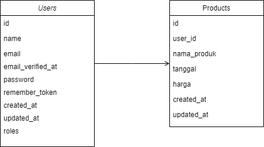

## 1. Tampilan Admin

## 2. Database Design

## 3. Setup Project
- Clone repository

```bash
git clone https://github.com/yusril86/DOT-Intern.git
```

- Install Composer
install composer pada project menggunakan perintah berikut :

```bash
composer install
```
- Setup .env .Copy isi .env.example kemudian buat file baru dengan nama .env dan paste 


- Setup Database
Buat table database mysql sesuai dengan nama database yang berada di .env 


- Lakukan database migration and seeder :
```bash
php artisan migrate --seed
```

## 4. Cara Penggunaan
- Jalankan menggunakan perintah:
```bash
php artisan serve
```
- Login dan Input Produk di admin Panel


- REST API : 
1. Tampilkan semua user  : "http://127.0.0.1:8000/api/users/all"
2. Pencarian user : "http://127.0.0.1:8000/api/user/search/?email={email}"
3. Detail user : "http://127.0.0.1:8000/api/user/detail/{id}"
4. Tampilkan semua Produk :  "http://127.0.0.1:8000/api/product/all"
5. Search Produk : "http://127.0.0.1:8000/api/product/search/?nama_produk={nama_produk}"
6. Detail user : "http://127.0.0.1:8000/api/product/detail/{id}"